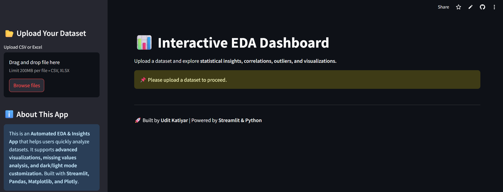

<<<<<<< HEAD
<div align="center">
  

  # 🚀 Smart Data Explorer 
  **AI-Powered Automated EDA & Data Visualization Dashboard**

  [](https://www.python.org/)
  [](https://streamlit.io/)
  [](https://www.docker.com/)
</div>


# Smart Data Explorer
The **Smart Data Explorer** is an automated Exploratory Data Analysis (EDA) web application. It takes raw datasets and instantly transforms them into meaningful, interactive data visualizations and summary statistics. It is highly beneficial for data professionals, researchers, and students because it heavily reduces the boilerplate code needed to understand data distributions, handle missing values, and analyze core data relationships. 

---

## Overview of the Project

When approaching a new dataset, Data Scientists spend roughly 70% of their time on data understanding and basic preprocessing. The Smart Data Explorer automates this exact process. By simply uploading a file, the application processes it and provides comprehensive insights—including correlation heatmaps, feature importance scoring via Scikit-Learn, and automated summary reports that outline unique and missing values in real-time.

---

## Features
- **📂 Multi-Format File Upload:** Seamlessly upload `.csv` or `.xlsx` datasets.
- **🛠️ Built-in Data Preprocessing:** Clean your data instantly by dropping non-valid rows or filling missing numeric values with the column mean.
- **📊 Interactive Advanced Visualizations:** 
  - Dynamic **Histograms** and **Box Plots** for distribution tracking.
  - Interactive **Scatter Plots** for relationships.
  - **Pie Charts** for categorical column breakdowns.
  - Custom **Correlation Heatmaps**.
- **🤖 AI-Driven Feature Importance:** Automatically computes and displays feature prominence if a `target` column is detected using a Random Forest algorithm.
- **🌗 Custom Theming & UI:** Built-in Light Mode and Dark Mode for the application canvas.
- **🐳 Dockerized Architecture:** Highly portable containerized setup.


---

## Tech Stack
| Layer / Category | Technology | Purpose |
| :--- | :--- | :--- |
| **Frontend / UI Layer** | Streamlit | Rapid development of interactive data components and rendering |
| **Data Processing Layer** | Pandas, NumPy | High-performance dataframe manipulation and calculations |
| **Visualization Layer** | Plotly, Seaborn, Matplotlib | Dynamic graphs and static statistical charts |
| **Machine Learning Layer** | Scikit-Learn | Supervised machine learning algorithms (Random Forest) |
| **Deployment & Ops** | Docker | Environment containerization and isolated dependency management |


---

## Project Structure

```plaintext
Smart-Data-Explorer/
├── app.py                   # Main Streamlit Application Logic
├── requirements.txt         # Project Dependencies
├── Dockerfile               # Docker instruction file
├── .dockerignore            # Excludes items during Docker build
├── .gitignore               # Excludes items from Git tracking
├── assets/                  # App images and UI assets
└── README.md                # Project Documentation
```
---

## Getting Started

### Prerequisites

- A modern web browser (Chrome, Firefox, Edge, or Safari)
- (Optional) [Docker](https://www.docker.com/products/docker-desktop/) for containerized deployment


### 🛑 Prerequisites
Before starting, ensure that you have the following installed on your machine:
- **Python 3.9+** (For local setup)
- **Git** (To clone the repository)
- **Docker Desktop** or **Docker Engine** (For Docker setup)


### Local Setup

1. **Clone the repository**

   ```bash
   git clone https://github.com/Satyamjai1003/Smart-Data-Explorer.git
   ```

2. **Navigate to the project directory**

   ```bash
   cd Dataset_-ns-ghts
   ```

3. **Create and activate a virtual environment (optional but recommended):**
   ```bash
   python -m venv venv
   # Windows
   venv\Scripts\activate
   # Linux/Mac
   source venv/bin/activate
   ```

4. **Install dependencies:**
   ```bash
   pip install -r requirements.txt
   ```
5. **Run the application:**
   ```bash
   streamlit run app.py
   ```
6. **Access the application**

   Open Navigate to `http://localhost:8501` in your browser.

---

## Docker Setup

### 📜 Understanding the Dockerfile
The project is containerized to prevent "it works on my machine" issues. Below is a breakdown of the instructions used in our `Dockerfile`:

- `FROM python:3.10-slim`: Uses a lightweight, official Python runtime image.
- `WORKDIR /app`: Sets the working directory inside the container.
- `ENV PYTHONDONTWRITEBYTECODE=1 & PYTHONUNBUFFERED=1`: Ensures Python behaves optimally in containers by not writing `.pyc` files and preventing logging delays.
- `COPY requirements.txt . & RUN pip install...`: Copies the dependency file and installs them first (leveraging Docker's cache).
- `COPY . .`: Copies the remaining application code.
- `RUN mkdir -p /root/.streamlit...`: Overrides Streamlit configurations to ensure it runs continuously in a headless mode properly suited for containers.
- `EXPOSE 8501`: Maps the application port making it available globally.
- `CMD ["streamlit", "run", "app.py", "--server.address=0.0.0.0"]`: The default command to start the web server when the container runs.

---

**Why use Docker for this project?**

- **Consistency** — The application behaves identically regardless of the host operating system.
- **No local dependencies** — No need to install or configure a web server manually.
- **Easy deployment** — A single command builds and runs the entire application.
- **Portability** — The Docker image can be shared, deployed to cloud services, or run on any Docker-enabled machine.

### Understanding the Dockerfile

The `Dockerfile` in this project defines how the application image is built:

```dockerfile
FROM python:3.10-slim

WORKDIR /app

# Improve Python behavior
ENV PYTHONDONTWRITEBYTECODE=1
ENV PYTHONUNBUFFERED=1

# Upgrade pip
RUN pip install --upgrade pip

# Install dependencies
COPY requirements.txt .
RUN pip install --no-cache-dir -r requirements.txt

# Copy project files
COPY . .

# Configure Streamlit
RUN mkdir -p /root/.streamlit && \
    echo "[browser]\ngatherUsageStats=false\n[server]\nheadless=true\nport=8501\nenableCORS=false" > /root/.streamlit/config.toml

EXPOSE 8501

CMD ["streamlit", "run", "app.py", "--server.address=0.0.0.0"]
```

| Instruction | Purpose |
|------------|--------|
| `FROM python:3.10-slim` | Uses a lightweight Python base image optimized for performance and smaller size |
| `WORKDIR /app` | Sets the working directory inside the container where all operations will be performed |
| `ENV PYTHONDONTWRITEBYTECODE=1` | Prevents Python from generating `.pyc` files, reducing unnecessary storage usage |
| `ENV PYTHONUNBUFFERED=1` | Ensures logs are displayed in real-time without buffering delays |
| `RUN pip install --upgrade pip` | Updates pip to the latest version for better package compatibility |
| `COPY requirements.txt .` | Copies the dependency file into the container |
| `RUN pip install --no-cache-dir -r requirements.txt` | Installs all required libraries without caching to keep the image lightweight |
| `COPY . .` | Copies all project files into the container environment |
| `RUN mkdir -p /root/.streamlit && echo "...config..."` | Creates and configures Streamlit settings for headless execution inside Docker |
| `EXPOSE 8501` | Documents that the application runs on port 8501 |
| `CMD ["streamlit", "run", "app.py", "--server.address=0.0.0.0"]` | Starts the Streamlit server when the container launches |


### Build and Run with Docker

**Step 1 — Build the Docker image**

```bash
docker build -t smart-data-explorer .
```

This command reads the `Dockerfile`, downloads the  base image, copies the application files, and creates a new Docker image tagged as `smart-data-explorer`.

**Step 2 — Run the container**

```bash
docker run -d -p 8501:8501 --name my-eda-app smart-data-explorer
```
| Flag | Description |
|------|------------|
| `-d` | Runs the container in detached (background) mode |
| `-p 8501:8501` | Maps port **8501** on your machine to port **8501** inside the container |
| `--name my-eda-app` | Assigns a custom name to the running container |
| `smart-data-explorer` | The name of the Docker image to run |

> The format -p HOST:CONTAINER means that requests sent to localhost:8501 on your machine are forwarded to port 8501 inside the container, where the Streamlit application is running.

**Step 3 — Verify the container is running**

```bash
docker ps
```

This lists all running containers. 

**Step 4 — Access the application**

Open `http://localhost:8501` in your browser.

**Step 5 — Stop and remove the container (when done)**

```bash
docker stop <container_id>
docker rm <container_id>
```

## Screenshots

The following screenshots demonstrate the application running successfully inside a Docker container.

### Docker Build

<!-- Replace with your screenshot path or URL -->


### Docker Run

<!-- Replace with your screenshot path or URL -->


### Docker PS (Container Status)

<!-- Replace with your screenshot path or URL -->


### Application Running on Localhost

<!-- Replace with your screenshot path or URL -->


---
## 🔮 Future Improvements
- **Automated PDF Exporting:** Add a button to download the generated exploratory analysis straight to a formatted PDF.
- **Support for Big Data Platforms:** Integrate with architectures like Dask or PySpark to handle files larger than 2GB natively.
- **Advanced Imputation Methods:** Allowing users to patch datasets using advanced algorithms like KNN-Imputation or interpolation rather than just column mean.
- **Time Series Module:** A dedicated tab recognizing dates and automatically visualizing trendlines, seasonality, and ARIMA forecasting.


---


## 🧑‍💻 Authors

- **Satyam Jaiswal** - *Core Development and Analysis Workflows* - [GitHub](https://github.com/Satyamjai1003) | [LinkedIn](https://www.linkedin.com/in/satyamjaiswal02/)
- **Udit Katiyar** - *Deployment, Architecture, and Version Control* - [GitHub](https://github.com/katiyarudit)

## License

This project is open source and available for personal and educational use.

=======
# Smart-Data-Explorer
Upload your dataset and uncover powerful insights with interactive charts, AI-driven analysis, and advanced visualizations.
>>>>>>> 2bd1a4374bdc2cde1c2595f1df2fe19dc68292f0
